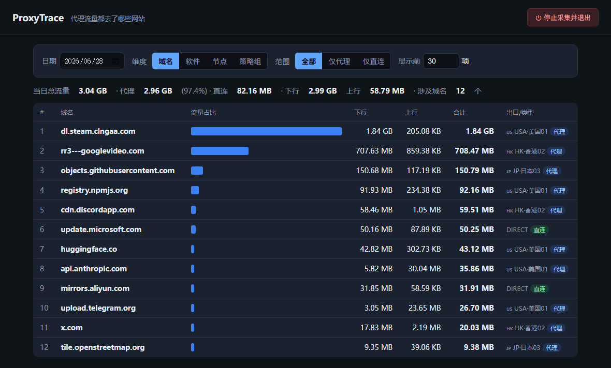

# ProxyTrace · 代理流量按域名记账

简体中文 | [English](README.en.md)

  

看清楚你的**代理流量平时都去了哪些网站、被哪个软件用了、走了哪个节点**，从而把耗流量大的站点改走别的节点或直连，省下代理流量。

专为 **Clash Verge Rev**（mihomo 内核）设计，**零第三方依赖**，只需 Python 3.8+。

> ⚠️ 目前仅支持 **Windows**（通过 Windows 命名管道访问 Clash 内核接口）。



> 上图为演示数据，真实数据只存在你本机的 `data/traffic.db`，不会上传。

---

## 环境要求

- Windows 10 / 11
- Python 3.8 及以上（到 [python.org](https://www.python.org/downloads/) 下载，安装时记得勾选 **Add Python to PATH**）
- 正在运行的 **Clash Verge Rev**（mihomo 内核）

## 安装

```bash
git clone https://github.com/Ultraman-Leo-7/proxytrace.git
```

或直接点 GitHub 上的 **Code → Download ZIP** 下载解压。放在任意目录都行（脚本会自动定位自身所在路径，不依赖固定路径）。

---

## 一分钟上手（双击即用，不用终端）

> 前提：已安装 Python，且 Clash Verge Rev 正在运行。

1. **双击 `启动.vbs`** —— 后台开始采集 + 自动打开网页面板（无黑窗、不占终端）。
2. 在网页里选日期，就能看到当天代理流量都去了哪些网站、各用了多少。
3. **不想用了**：点网页右上角「⏻ 停止采集并退出」按钮，或**双击 `停止.vbs`**。停止后不再采集，网页也会失效。

就这么简单。想看历史，随时再双击 `启动.vbs` 即可（它会一直在后台记录，直到你停止）。

> 已经在运行时再次双击 `启动.vbs`，只会重新打开网页，不会重复采集。

---

## 它解决什么问题

Clash Verge Rev 自带的「连接」页是**实时、内存级**的：关闭的连接只缓存 500 条、重启或切换订阅就清零，**无法回看历史、也无法按天汇总**。GitHub 上的现成项目要么是实时面板，要么是只导出总量的 Prometheus exporter（因高基数问题故意不按域名拆分）；DNS 方案（AdGuard）只记域名次数、没有流量大小，且 fake-ip 下会漏记代理域名。

ProxyTrace 给 Clash 外挂一个「记账员」：每秒读取一次连接快照，按连接做字节增量累加，按 **日期 + 域名 + 进程 + 节点** 存进本地 SQLite。之后你就能查「某天 top 网站各用了多少代理流量」。

---

## 工作原理

- 通过 Windows 命名管道 `\\.\pipe\verge-mihomo` 访问 mihomo 的 `/connections` 接口（Clash Verge Rev 默认只走管道、不监听 TCP 端口，本工具已适配，**无需你改任何 Clash 配置**）。
- 每条连接的 `upload`/`download` 在其生命周期内单调递增。采集器记住每个连接 id 上次的字节数，每轮只累加**增量**；连接关闭后从快照消失，其最后一次增量已计入。内核重启 / 切换订阅后连接 id 全新，自动当作新连接处理。
- 域名取自 `metadata.host`（fake-ip 模式下也准），缺失时回退到 `sniffHost` → 目标 IP。出口节点取代理链 `chains[0]`，纯直连显示 `DIRECT`。

> **关于「(unknown) 软件」**：个别连接 mihomo 抓不到所属进程名，会归到 `(unknown)`。这些流量**照常统计**（域名、字节数都准），只是不知道是哪个程序发起的。
>
> **关于精度**：存活时间短于一个轮询周期（默认 1 秒）的连接可能少计——但大流量都是长连接（下载 / 视频 / 同步），影响可忽略。跨午夜的长连接会按每轮所在日期分别计入，正确。

---

## 开机自启（可选，自己按需设置）

想让它开机后自动在后台采集（这样才有连续的历史可查），有两种方式：

**方式一：运行脚本（推荐）**
```powershell
powershell -ExecutionPolicy Bypass -File scripts\install-autostart.ps1
```
它会在「开始 - 启动」文件夹放一个指向 `启动.vbs` 的快捷方式。下次登录系统就会自动后台启动。
取消：`powershell -ExecutionPolicy Bypass -File scripts\uninstall-autostart.ps1`

**方式二：手动设置**
1. 按 `Win + R`，输入 `shell:startup` 回车，打开「启动」文件夹。
2. 把项目里的 `启动.vbs` **右键 → 创建快捷方式**，把快捷方式拖进该文件夹即可。
3. 取消自启就删掉该快捷方式。

---

## 进阶：命令行报表

不想开网页时，也可以用命令行快速查看（需要一个终端窗口）：

```powershell
cd 项目目录                                 # 换成你克隆/解压的实际路径
python run.py report                       # 今天 top20（按域名）
python run.py report --date 2026-06-19     # 指定某天
python run.py report --days 7              # 最近 7 天合计
python run.py report --by process          # 按软件统计（哪个程序最耗流量）
python run.py report --by node             # 按出口节点统计
python run.py report --proxied-only        # 只看走代理的流量
python run.py report --top 50              # 显示前 50 项
```

底部会给出当天**代理 vs 直连**总量与占比。

其它命令：
```powershell
python run.py test       # 测试能否连上 Clash 内核
python run.py app        # 在终端前台运行采集+面板（调试用，Ctrl+C 停）
python run.py stop       # 停止后台运行的程序（等价于双击 停止.vbs）
```

---

## 拿到结果后怎么省流量

在面板/报表里找出耗流量大的域名后，去 Clash Verge Rev 的配置里把它们改走别的节点或直连，例如在规则里加：

```yaml
rules:
  - DOMAIN-SUFFIX,update.microsoft.com,DIRECT   # 系统更新直连，不占代理
  - DOMAIN-SUFFIX,某大流量域名,香港节点          # 改走指定节点
```

---

## 配置（config.json）

首次运行自动生成，可按需修改：

| 键 | 默认值 | 说明 |
|---|---|---|
| `transport` | `auto` | `auto` 在 Windows 上走命名管道；也可设 `pipe` / `tcp` |
| `pipe_name` | `verge-mihomo` | 命名管道名 |
| `controller_url` | `http://127.0.0.1:9090` | `transport=tcp` 时使用 |
| `secret` | `""` | external-controller 密钥（走管道无需） |
| `poll_interval` | `1.0` | 轮询间隔（秒），越小越精确、开销略增 |
| `flush_interval` | `5.0` | 写入数据库间隔（秒） |
| `db_path` | `data/traffic.db` | 数据库路径 |
| `dashboard_port` | `8788` | 网页面板端口 |
| `retention_days` | `0` | 数据保留天数，`0` = 永久 |

> 如果你用的是 **mihomo 内核**或开启了 external-controller 的其它客户端，可把 `transport` 设为 `tcp`，并填好 `controller_url` 与 `secret`。

---

## 排错

- **双击 `启动.vbs` 没反应 / 网页打不开**：先 `python run.py test` 看能否连上 Clash 内核；确认 Clash Verge Rev 正在运行。后台运行的日志在 `data\proxytrace.log`，可打开查看报错。
- **报表 / 网页为空**：采集程序没在跑，或刚启动还没产生流量。双击 `启动.vbs` 后稍等片刻再刷新。
- **想确认是否在后台运行**：任务管理器里看有没有 `pythonw.exe`；或看 `data\proxytrace.pid` 是否存在。
- **彻底停止**：双击 `停止.vbs`（或网页上的停止按钮）。

---

## 项目结构

```
启动.vbs                后台启动采集 + 网页面板（双击即用，UTF-16 编码）
停止.vbs                停止采集并关闭网页
run.py                  命令行入口（app / report / test / stop ...）
config.json             配置（首次运行自动生成）
proxytrace/
  config.py             配置读写
  mihomo.py             接口客户端（命名管道 + TCP，HTTP/chunked）
  storage.py            SQLite 存储与查询
  collector.py          采集（增量累加，可线程驱动）
  dashboard.py          本地网页面板（含停止接口）
  app.py                一体化：采集 + 面板 + 单实例 + 自动开浏览器
  report.py             命令行报表
scripts/
  install-autostart.ps1 设置开机自启
  uninstall-autostart.ps1
data/
  traffic.db            数据库（运行后生成）
  proxytrace.pid        运行中进程号（运行时存在）
  proxytrace.log        后台日志（pythonw 模式输出）
```

---

## 许可

[MIT](LICENSE) © 2026 Ultraman-Leo-7
